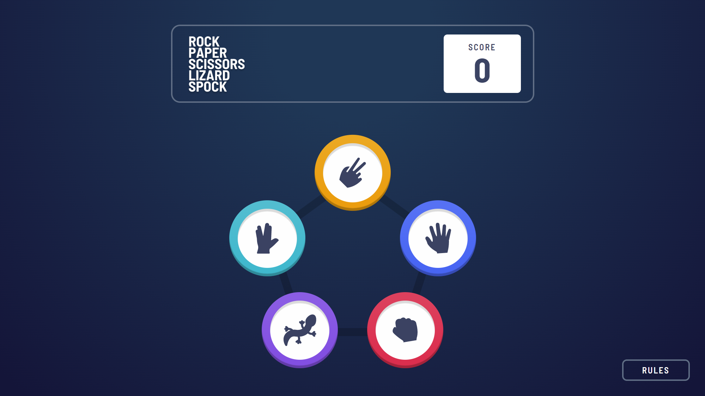

# Frontend Mentor - Rock, Paper, Scissors solution

This is a solution to the [Rock, Paper, Scissors challenge on Frontend Mentor](https://www.frontendmentor.io/challenges/rock-paper-scissors-game-pTgwgvgH). Frontend Mentor challenges help you improve your coding skills by building realistic projects.

The site is optimized to work with the resolutions:

- Mobile: 375px
- Desktop: 1366px

You can see the site [clicking here](https://fakeastronauta.github.io/rock-paper-cissors-solution/)

## Screenshot

## My process

It required some basic logic to implement the game flow; I just had to give priority to the 'win' and 'tie' results.

Always focusing in 'oocss' for the styles.

### Built with

- Semantic HTML5 markup
- Flexbox
- [React](https://reactjs.org/) - JS library
